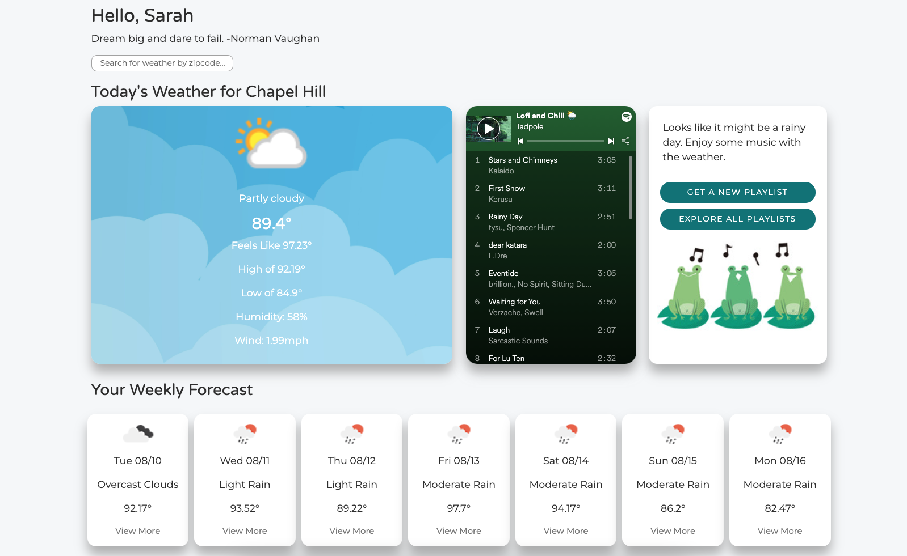

# Tadpole

Tadpole is a PERN web application that combines music and weather. After users create their account, they are directed to their customized dashboard where curated playlists will display based on the weather. Users have the option to get a new weather-based playlist or browse all of Tadpole's playlists on Spotify. The dashboard is also a place where users can check out the daily and weekly weather for their saved location or search for the weather of another city based on zipcode.

Create an account and start jamming at [Tadpole](https://tadpole.netlify.app/).

Server-side code can be found [here](https://github.com/sarahdepalo/tadpole_backend).

## Screenshots

## Future Goals
Active development for this app was August 3rd-9th, 2021. Given more time, I would have liked to add a feature that allowed users to save multiple locations or change their saved/home location. I would've also liked to add more weather information such as a radar or map. A strech goal of mine is to incorporate the Spotify API and create a more custom user experience such as connecting to a user's Spotify and letting them add songs they enjoy to their own playlists.  

## Frameworks & Languages Used 
* React
* Express
* Node.js
* PostgreSQL
* Javascript
* HTML
* CSS

## APIs Used
* [OpenWeather API ](https://openweathermap.org/api)
* [WeatherApi](https://www.weatherapi.com/) - used for the daily weather icon

## Credits

The user login and registration code mainly came from this awesome [tutorial](https://www.youtube.com/watch?v=7UQBMb8ZpuE&t=1s).
